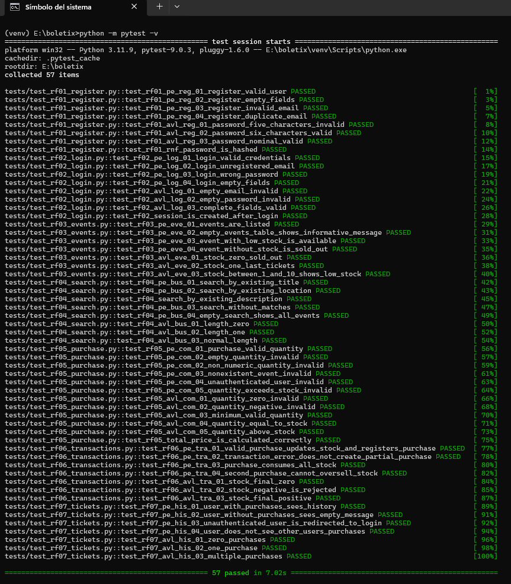
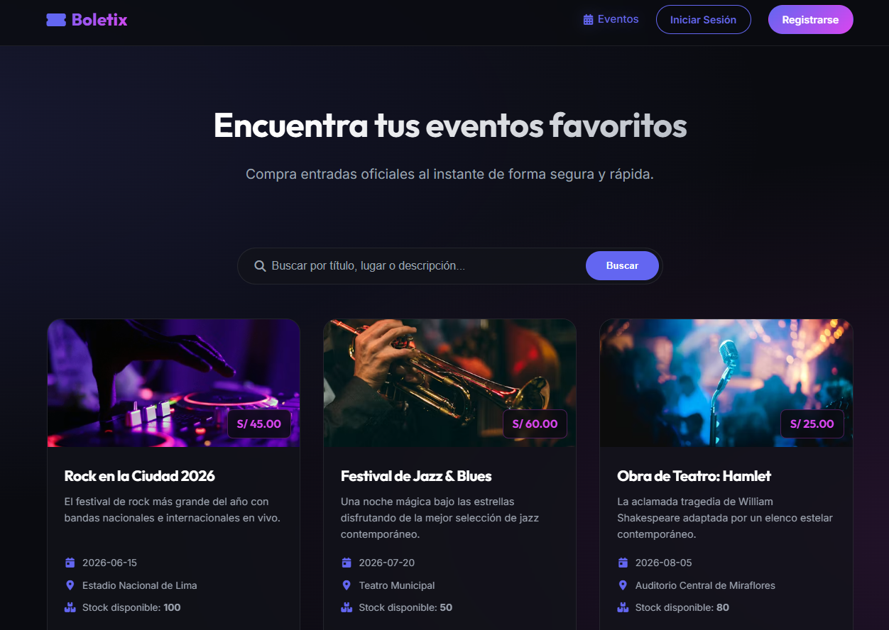
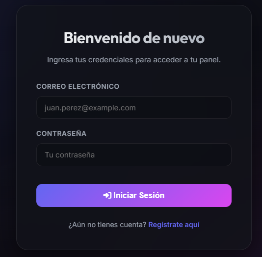
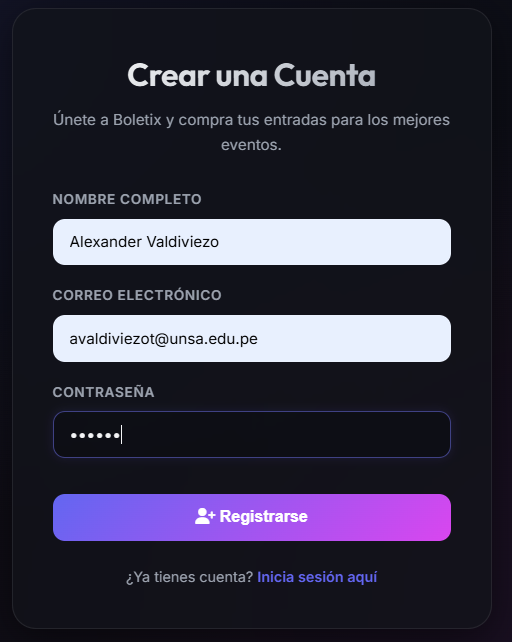
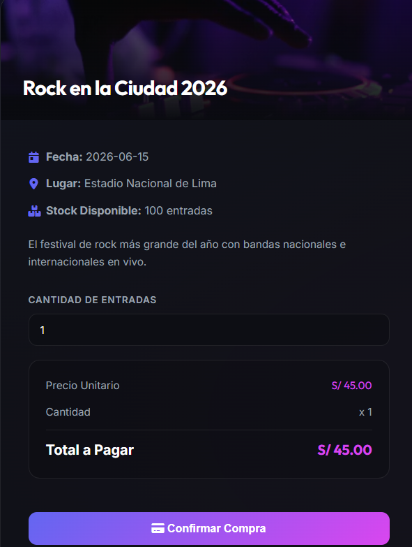
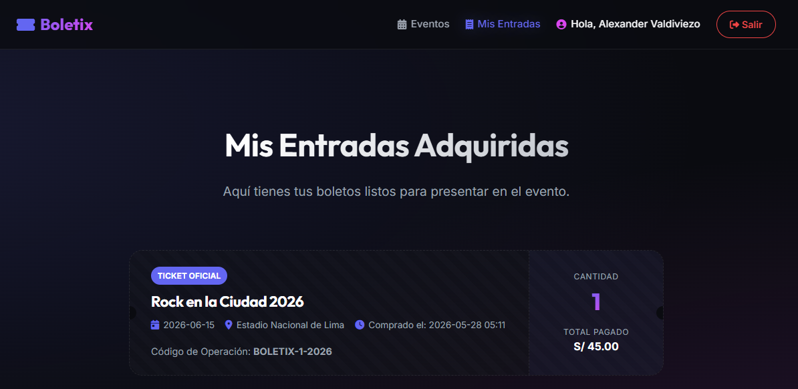

# Boletix - Plataforma de Venta de Entradas para Eventos 🎟️

Boletix es una plataforma web estilo MVP (Mínimo Producto Viable) diseñada para la venta y gestión de entradas para eventos. Este proyecto está desarrollado utilizando **Python Flask** en el backend, **SQLite** para el almacenamiento de datos, **HTML/CSS/JS nativo** en el frontend, y **pytest** para una suite de pruebas unitarias robusta.

Este proyecto tiene fines académicos para estudiantes universitarios de ingeniería de software, demostrando buenas prácticas de estructuración de código.

---

## 🚀 Características Principales

1. **Autenticación Completa**: Registro de nuevos usuarios con validación de emails y hashing seguro de contraseñas, e inicio de sesión manteniendo el estado de la sesión.
2. **Catálogo de Eventos**: Listado dinámico de eventos que muestra el precio, la fecha, el lugar, el stock en tiempo real y badges dinámicos según la disponibilidad ("¡Últimas entradas!", "Agotado").
3. **Buscador Integrado**: Filtro en caliente que realiza búsquedas seguras en la base de datos basándose en el título, descripción o lugar de los eventos.
4. **Compra Atómica**: Formulario de adquisición de entradas que calcula automáticamente el costo total en tiempo real y procesa la compra en el servidor bajo una transacción SQLite atómica para garantizar que no exista sobreventa.
5. **Historial de Boletos**: Sección "Mis Entradas" donde el usuario autenticado puede visualizar sus boletos oficiales en un diseño premium tipo ticket físico recortable con código de operación único.
6. **Diseño Premium**: Interfaz moderna estilo *cyberpunk/dark space* usando variables CSS, efectos de vidrio (glassmorphism), transiciones fluidas, animaciones en las alertas y diseño 100% responsivo para móviles y ordenadores.

---

## 📁 Estructura del Proyecto

```
PLATAFORMA-VENTA-ENTRADAS/
├── app.py                      # Servidor backend de Flask y enrutamiento
├── database.py                 # Lógica de conexión e inicialización de SQLite
├── requirements.txt            # Dependencias del proyecto
├── README.md                   # Manual de usuario e instalación
├── REQUIREMENTS.md             # Especificación de requisitos y tablas PE/AVL
├── templates/                  # Vistas del Frontend (HTML5 con Jinja2)
│   ├── base.html               # Estructura maestra global
│   ├── login.html              # Formulario de Inicio de Sesión
│   ├── register.html           # Formulario de Registro de Usuario
│   ├── index.html              # Catálogo general y buscador
│   ├── purchase.html           # Interfaz de compra y cálculo dinámico
│   └── tickets.html            # Historial de entradas oficiales del usuario
├── static/                     # Archivos Estáticos del Frontend
│   ├── css/
│   │   └── style.css           # Estilos estéticos premium y animaciones
│   └── js/
│       └── main.js             # Validaciones en cliente e interactividad
└── tests/                      # Suite de Pruebas Unitarias
    ├── conftest.py             # Fixtures de pytest y base de datos aislada
    └── test_app.py             # Casos de prueba reales
```

---

## 🛠️ Instalación y Configuración Paso a Paso

Sigue estos sencillos pasos para instalar y ejecutar el proyecto en tu sistema local.

### 1. Clonar o copiar el proyecto a tu espacio de trabajo
Asegúrate de encontrarte en la carpeta raíz del proyecto.

### 2. Crear y activar un Entorno Virtual (Recomendado)
Para mantener las dependencias aisladas y limpias de otros proyectos:

**En Windows (PowerShell):**
```powershell
python -m venv venv
.\venv\Scripts\Activate.ps1
```

**En Windows (CMD):**
```cmd
python -m venv venv
call venv\Scripts\activate.bat
```

### 3. Instalar las Dependencias
Una vez activado el entorno virtual, instala las librerías necesarias:
```bash
pip install -r requirements.txt
```

---

## 💻 Cómo Ejecutar el Proyecto

El servidor Flask se encargará de inicializar la base de datos SQLite de forma automática en el primer arranque y cargar los eventos de demostración si es necesario.

Para iniciar el servidor, ejecuta el siguiente comando:
```bash
python app.py
```

Deberías ver un mensaje en consola indicando que el servidor está corriendo. Abre tu navegador preferido e ingresa a la siguiente dirección:
```
http://127.0.0.1:5000
```

---

## 🧪 Cómo Ejecutar las Pruebas Unitarias

La suite de pruebas automatizadas está diseñada con `pytest` y evalúa el backend de forma rigurosa simulando peticiones HTTP válidas e inválidas, aislando los datos mediante una base de datos temporal que se limpia al terminar de testear.

Para ejecutar todas las pruebas unitarias, corre el siguiente comando en tu terminal:
```bash
pytest -v
```

El parámetro `-v` (verbose) mostrará el detalle de cada prueba unitaria que se está certificando.


## Capturas del Sistema

### Página principal


### Inicio de sesión


### Registro de usuario


### Compra de entradas


### Entradas adquiridas

